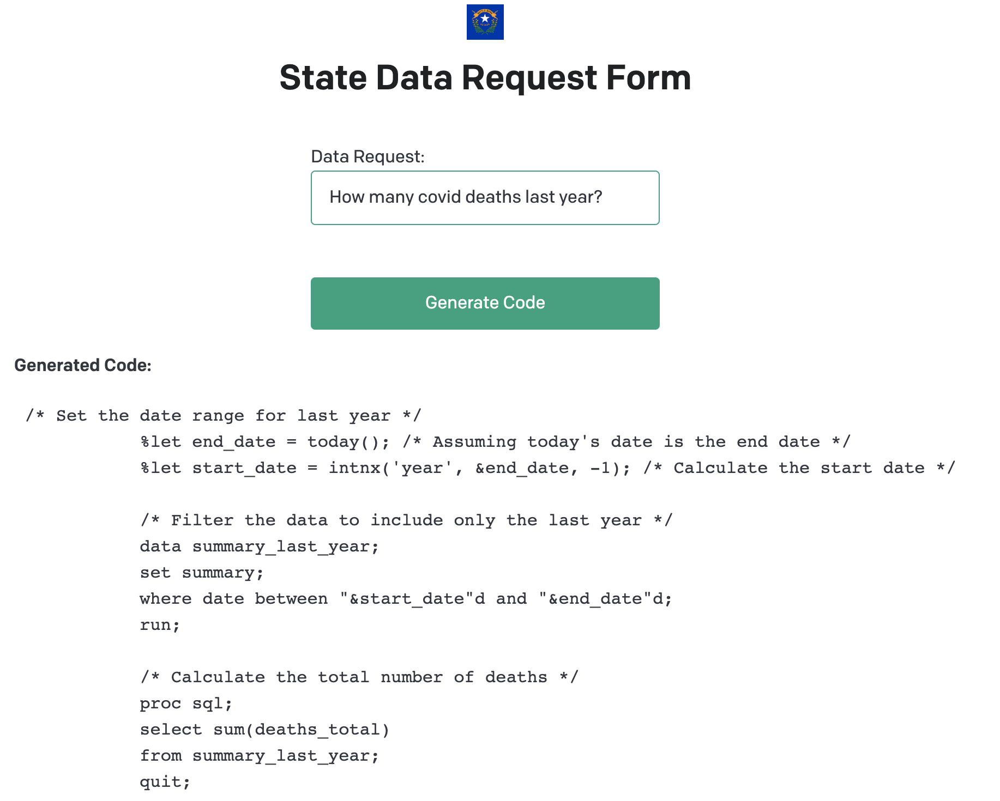

# Analyst - Ask questions, receive analyst-like code for COVID-19 GCP connected public datasets instanteously.

### Why?
Many state governments, including Nevada use closed-source languages like SAS. Often reporters and interested parties will request data from the state for articles, stories, and publications. As it can be imagined, many may come through at any one time, especially during COVID in which the analyst does not have sufficient time to respond to the many questions in the portal. With Analyst we take a stab at automating these very import requests via a [Flask](https://flask.palletsprojects.com/en/2.0.x/) framework so that analysts can be freed up from writing redundant and time-consuming requests.

### How?
The Flask application is able to connect to GCP via IAM credentials and uploads the schema of the BigQuery dataset for understanding of the data. This schema is passed to the [OpenAI API](https://beta.openai.com/docs/quickstart) GPT Completions endpoint which is able to generate a SAS query based on the question asked. The query is then executed and the results are returned to the user.
Mappings of IAM authentication, BQ data types and SAS data types happen behind the scenes.

### Example

### Further Development
- [ ] Create dropdown for topic selection (helps non-technical staff to identify correct dataset)
- [ ] Create dropdown for language selection